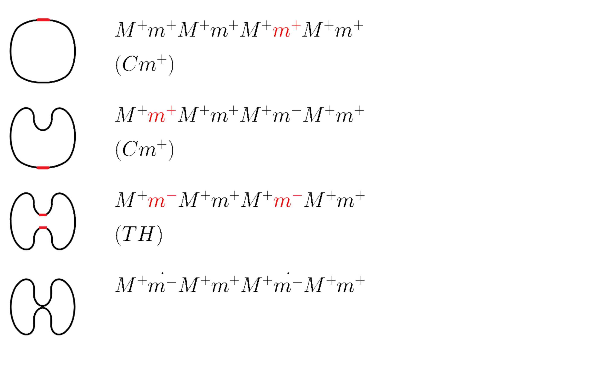

# MEMBRANE TRANSITION

- 細胞膜の形状遷移のvisualizer




---
## Authors
- ソースコード、DBテキスト: M.Noda (GitHub: void-hoge)
- DB画像: K.Takahashi

## References
- Tosue,M. and K.Takahashi: "Towards a Qualitative Reasoning on Shape Change and Object Division," 14th International Conference on Spatial Information Theory (COSIT 2019), pp.7:1-7:15, LIPICS Vol. 142, ISBN 978-3-95977-115-3, September, 2019.

- 東末桃：「形状変化に関する定性的な記述方式と推論およびその性質について」関西学院大学大学院理工学研究科修士論文.

## License
- GPLv3

---
## 実行
- Python3, pygame, Pillow, matplotlibを使用。
- `$ ./main.py`で実行
  - レンダリング、グラフの構成、GUIでの表示を全て行える。

## 画像の用意
- 使用する画像は、全て`DBfigures/`直下に置く必要がある。
- 拡張子は`.png`のみをサポートしている。
- 画像のファイル名はスペース、`$`を含んではならない。

## latex式の制約
- `DBfigures/allpics.txt`と`DBfigures/graph.txt`にはlatex式を書くことができる。
- latex式とは`$`で囲まれた文字列である。スペースやタブ文字を含めることができるが、改行を含めることはできない。
- 一つの画像、ルールを表現する式として、複数のlatex式を含めることはできない。

## DBfigures/allpics.txt
画像を一括で読み込むためのテーブル。行ごとの順序は問わない。

各行は`画像のbasename latex式`か、`rule_変換規則名 latex式`で構成される。
- `画像のbasename latex式`
  - 読み込みたい画像と、その状態を表す式を表現する。
  - 画像のbasenameとは、拡張子を除いた名前のこと
    - 例えば、`figX.png`が、`$hogepoyo$`の時、その行は`figX $hogepoyo$`となる。
    - この時、render.pyで`DBfigures/figX_fml.png`が生成され、main.pyで`DBfigures/figX.png`と`DBfigures/figX_fml.png`が読み込まれる。
- `rule_変換規則名 latex式`
  - 変換規則と、その状態を表す式を表現する。
  - 変換規則名はファイルとして保存するためだけのもので、先頭が`rule_`となっていて、重複がないならなんでも良い。(main.pyでは、式の文字列そのものをキーとした辞書を使うため)
    - 例えば、`$(TU)$`というルールの式を生成するとき、`rule_TU $(TU)$`とする。(`rule_TU`のところは`rule_*`の形を満たせばなんでも良い。)
    - この時、`DBfigures/rule_TU_fml.png`が生成される。

## DBfigures/graph.txt
遷移を行う有向辺を記述するテーブル。1行目は初期状態から始まる辺である必要があるが、その他の順序は自由

各行は`src dst highlighted x y rule`で構成される。
- `src`
  - 遷移前の画像のbasename
- `dst`
  - 遷移後の画像のbasename
- `highlighted`
  - 変化する部分をハイライトした画像のbasename
- `x y`
  - 選択するときに中心とする座標(highlightedのハイライトされた場所の中心)
  - 画像の左上を(0,0)、右下を(1,1)とする(下図)
```
(0,0)---(1,0)
　|       |
　|       |
　|       |
(0,1)---(1,1)
```

- `rule`
  - 使用するルールのlatex式(画像の名前ではない)
- 例
  - `fig1.png`から`fig2.png`への辺で、ハイライトされた画像が`fig1_fig2.png`、座標が(0.5, 0.2)、ルールが`$(Cm^{+})$`の時
  - `fig1 fig2 fig1_fig2 0.5 0.2 $(Cm^{+})$`
  - この行をファイルの先頭に置くと、`fig1.png`が初期状態になる。

## 操作
- 左上から画像が表示される。
- 最も下にある画像にマウスオーバーすると、マウスの場所と最も近い変化点を持つ候補が表示される。
- その状態でクリックすると、その状態が適用され、変化を行なった画像が一つ追加される。
- j, kまたはマウスホイールでスクロール、qで終了(lessと同じ操作)
- h, lで左右に移動
- uでundo、rでreset

## プログラム構成
### render.py
- DBfigures/allpics.txtに記載された数式をレンダリングする。
- 前回実行時の数式などの状態をprev.txtに保存しておき、更新があった要素のみをレンダリングする。
- prev.txtを削除すると、全ての式をレンダリングし直す。

### graph.py
- graph.edge
  - 辺の情報を保持するクラス
  - dst: distination
  - highlighted: ハイライトされた画像
  - x, y: 選択するときの中心座標
  - rule: ルールを表す式
- graph.graph
  - グラフの情報とたどった経路の情報を保持するクラス
  - node: ノードのリスト、それぞれはファイルのbasename
  - path: 遷移したノードのリスト、それぞれはファイルのbasename
  - edge_path: 遷移したエッジのリスト、それぞれはedgeのインスタンス
- graph.graph.get_next()
  - 現在の状態から出ているエッジをリストで返す
- graph.graph.reset()
  - pathとedge_pathをリセットする。
  - pathには初期状態が入るようになり、edge_pathは空になる。
- graph.graph.push_path(edg)
  - パスにエッジを追加して、遷移させる。
  - edgeのインスタンスを引数にとる。
  - pathにedg.dstを追加
  - edge_pathにedgを追加
- graph.graph.pop_path()
  - パスから一つポップし、遷移を巻き戻す
  - edge_pathとpathを一回ポップする。
  - len(path)が1より小さいときはポップしない。

### main.py
- main.transition
  - 描画に必要な全ての情報を保持するクラス
  - image: 状態を表す全ての画像と、変化する場所がハイライトされた画像を保持する辞書。キーはファイルのbasename、値はpygame.Surface
  - formula: 状態を表す全ての式の画像と、変化する場所がハイライトされた式の画像を保持する辞書。キーはファイルのbasename、値はpygame.Surface
  - rule: ルールを表す全ての式の画像を保持する辞書。キーは式のlatexコード、値はpygame.Surface
  - tree: graph.graphのインスタンス
- main.transform.loadimage()
  - DBfigures/allpics.txtから全ての画像データを読み込む。
  - 先頭が"rule_"の場合
    - ルールとして、self.ruleに読み込む
  - 先頭が"rule_"でない場合
    - 画像として、self.imageに読み込む
    - 式を、self.formulaに読み込む
- main.transition.setpath()
  - 遷移してきたパスを表示する。
  - 現在の状態以外では、変化した場所がハイライトされた画像を読み込む
- main.transition.replace_selected(mousepos, image, ispressed)
  - マウスが現在の状態の画像を指しているとき、適当な画像に置き換える。
  - graph.get_next()で候補となるエッジを得る。
  - マウスと最も近い点を持つエッジの変化点ハイライトされた画像を表示する。
  - 式とルールも適当なものに書き換える。
  - マウスが押されているとき、self.treeに選択されているエッジをpushする。
- main.transition.draw()
  - メインループのための関数
  - キーイベントなどを制御する。
